# Photographer Hub

**Photographer Hub** is a professional full-stack e-commerce application built with Python (Django), designed to provide a "Fine Art" digital marketplace for photography enthusiasts and a booking management system for exclusive photoshoot sessions. The platform operates on a B2C (Business to Consumer) business model, selling high-resolution digital art licenses and professional photography services directly to clients.

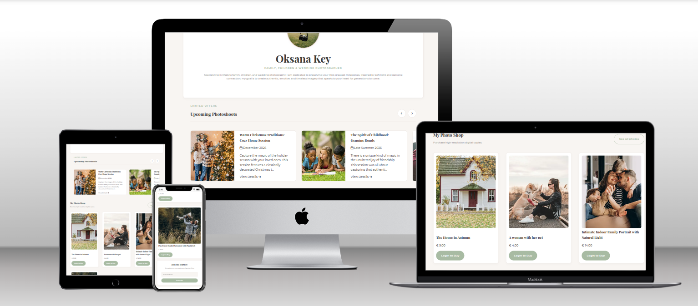 <br>
*Figure: The mockup was created with [Techsini](https://techsini.com/multi-mockup/)*

The application is deployed to Heroku and can be accessed at:
* **[Link to Live Site](https://photographer-hub-94aeeeedb69e.herokuapp.com/)**
* **[Link to GitHub Repository](https://github.com/Katerynakulik/photographer_hub)** 
---

# Project Overview

## Business Model (B2C)
**Photographer Hub** operates as a **Business-to-Consumer (B2C)** e-commerce platform. The site owner (a professional photographer) manages a centrally-owned dataset of artistic works and service offerings. The platform provides value through two primary revenue streams:
* **Digital Goods:** Sale of high-resolution digital licenses for photography enthusiasts and interior designers.
* **Professional Services:** A pre-registration and deposit system for exclusive photoshoot sessions, allowing the photographer to gauge interest and plan high-demand events effectively.

## User Goals
### As a Visitor:
* To browse a high-quality portfolio and understand the photographer's aesthetic.
* To easily find pricing and service details without administrative friction.
* To register an interest in upcoming sessions to secure a potential spot.

### As a Registered Customer:
* To manage a personal library of purchased high-resolution digital assets.
* To pay deposits securely and track active photoshoot interests.
* To communicate with the photographer via dedicated contact and interest forms.

### As the Site Owner (Photographer):
* To maintain full CRUD control over the gallery and session listings via a frontend dashboard.
* To collect marketing data and gauge demand for specific photoshoot themes before committing to a schedule.
* To automate the payment process for both products and service deposits.

## Target Audience
* **Art Collectors & Designers:** Individuals looking for professional digital art for personal or commercial displays.
* **Photography Clients:** People interested in booking high-end, themed photoshoots (portraits, weddings, seasonal events).
* **Newsletter Subscribers:** A community interested in photography tips and exclusive first-look access to new collections.

## User Requirements and Expectations
* **Visual Excellence:** A "Fine Art" aesthetic that prioritizes the imagery.
* **Security:** Industry-standard encryption for payments (Stripe) and authentication (Django Allauth).
* **Intuitive UX:** A navigation system that allows reaching any product or session in under 3 clicks.
* **Instant Feedback:** Clear notifications for cart updates, form submissions, and payment status.
---

## Agile Methodology

The development of **Photographer Hub** followed an Agile workflow, utilizing **GitHub Projects** to manage a Kanban board and prioritize tasks using the **MoSCoW method**. This ensured a structured development process where core e-commerce features were delivered first, followed by specialized booking services and final quality assurance.

### User Stories
The following User Stories, each with specific Acceptance Criteria, formed the basis of the development process:

#### Visitor Stories
* **#1 View Homepage:** As a visitor, I want to view a clear homepage so that I immediately understand the purpose of the site.
* **#2 Navigate Website:** As a visitor, I want a consistent main menu so that I can access all sections easily.
* **#7 Browse Products:** As a visitor, I want to browse photo products with pricing so that I can decide what to buy.
* **#8 View Product Details:** As a visitor, I want to see detailed product information and a preview image so that I understand what I am purchasing.
* **#12 View Sessions:** As a visitor, I want to see upcoming photo sessions so that I can choose one to join.
* **#13 View Session Details:** As a visitor, I want to view session themes and descriptions to understand the creative concept.
* **#18 Contact & Marketing:** As a visitor, I want to send a message through a contact form so that I can ask specific questions.
* **#3 View 404 Page:** As a visitor, I want to see a custom branded 404 page if I access a non-existing URL to return safely to the home page.

#### Customer Stories
* **#4 Register Account:** As a visitor, I want to register an account so that I can purchase photos and manage my bookings.
* **#5 Login / Logout:** As a registered user, I want to log in and out securely to protect my data and purchases.
* **#9 Add to Cart:** As a user, I want to add products or session deposits to a cart to purchase multiple items at once.
* **#10 Checkout with Stripe:** As a user, I want to pay securely using Stripe to complete my purchase.
* **#16 Express Interest:** As a user, I want to register interest in a new session to help the photographer plan upcoming sets.
* **#17 Pay Deposit:** As a user, I want to pay a small deposit for pre-registration to confirm my intent to participate.
* **#11 Access Purchased Photos:** As a logged-in user, I want to access my purchased photos in a private library anytime.
* **#14 Book a Slot (Future):** As a user, I want to reserve a specific time slot (Should Have/Backlog).
* **#15 Cancel Booking:** As a user, I want to cancel my interest/booking to free up space if my plans change.

#### Admin (Site Owner) Stories
* **#6 Role-Based Access:** As a site owner, I want admin-only access to management tools to protect the integrity of the gallery and session data.
* **#CRUD Management:** As an admin, I want to Create, Read, Update, and Delete products and sessions directly from a frontend dashboard.

### Kanban Board & MoSCoW Prioritization
The project utilized the **MoSCoW method** to ensure the most critical business value was delivered within the timeframe:

* **Must Have:** Secure authentication, Stripe integration, and core Product CRUD functionality.
* **Should Have:** Session interest forms, deposit payments, and user profile management.
* **Could Have:** Automated slot management, newsletter integration, and advanced SEO tools.

### Project Milestones
The development was organized into five distinct milestones, as reflected in the project management board:

1. **Milestone 1: Products + Stripe Checkout** (#1, #2, #3, #4, #5, #7, #8, #10) - Core storefront and payment foundation.
2. **Milestone 2: Sessions + Slots + Booking** (#9, #11, #12, #13, #14, #15) - Service listings and post-purchase content access.
3. **Milestone 3: Pre-registration + Deposit** (#16, #17) - Gauging user interest and securing commitments for upcoming events.
4. **Milestone 4: Marketing + SEO** (#18, #19, #20) - Brand reach through Facebook Business integration and Search Engine Optimization.
5. **Milestone 5: QA, Testing, Polish, Documentation** (#22, #25, #26, #27, #28, #29) - Final verification of code integrity, security audits, and deployment.

### GitHub Projects Board Overview


*Figure: Snapshots of the GitHub Projects board showing issue tracking and milestone distribution.*

## Future Implementations

### **Automated Capacity Management (#14)**
While the current system allows interest registration and deposit payments, it does not strictly enforce a maximum number of participants per session in real-time. 
* **Planned:** Implementation of a `max_capacity` field in the `Photoshoot` model and a calendar view for specific date selection.
* **Target Status:** Backlog for Milestone 5.

### **Persistent Message Storage (#18)**
Currently, the contact form provides immediate feedback to the user.
* **Planned:** Creation of a `ContactMessage` model to store all inquiries in the database for the photographer to review in the dashboard.

---

## Design

The design of **Photographer Hub** is rooted in a "Fine Art" aesthetic, emphasizing minimalism, sophisticated proportions, and a serene atmosphere that complements high-end photography without over-powering it.

### **Colours**

The project uses a muted, earthy colour palette to evoke a sense of professional artistry and calm. Instead of high-contrast vibrant tones, the site relies on soft ivories, sages, and blush tones to create a premium gallery feel.


*Figure: The unified colour palette extracted from Adobe Color.*

| Variable | Hex Code | Name | Primary Usage |
|:---|:---:|:---|:---|
| `--bg-color` | `#F8F5F2` | **Warm Ivory** | Primary site background for a soft, premium feel. |
| `--primary-color` | `#A8BBA3` | **Muted Sage** | Main brand colour, buttons, and navigation links. |
| `--hover-color` | `#D6A5A1` | **Dusty Rose** | Interaction states, cart badges, and error highlights. |
| `--accent-soft` | `#E8CFCB` | **Soft Blush** | Decorative accents (e.g., the oval avatar border). |
| `--text-color` | `#3A3A3A` | **Charcoal** | Primary body and heading text for high readability. |
| `--border-color` | `#E9E1DC` | **Taupe** | Subtle dividers, card borders, and input outlines. |

### **Project Planning & Wireframes**

The structural foundation of the project was planned using **Balsamiq**. This phase was crucial for mapping out the user journey and ensuring that the integration of the Django cart logic and Stripe payments remained intuitive.

#### **User Experience (UX) - Public Pages**
The focus was on creating a distraction-free environment to showcase digital art.

| Home Page | Complete Gallery | Shopping Cart |
|:---:|:---:|:---:|
| 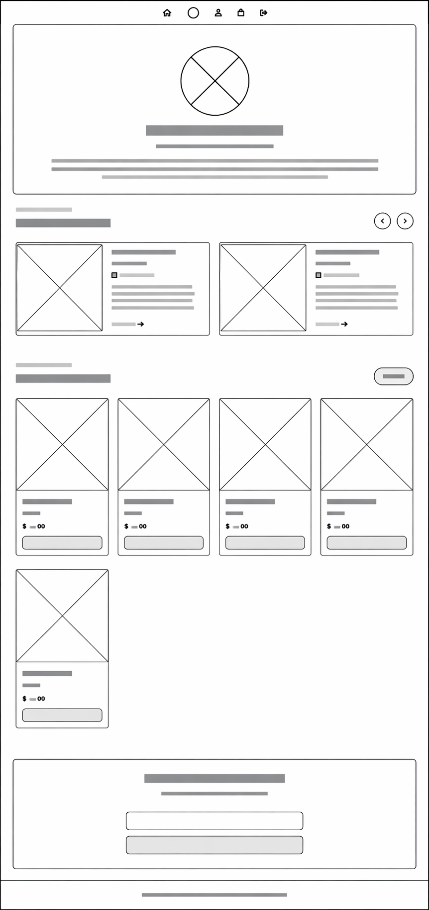 | 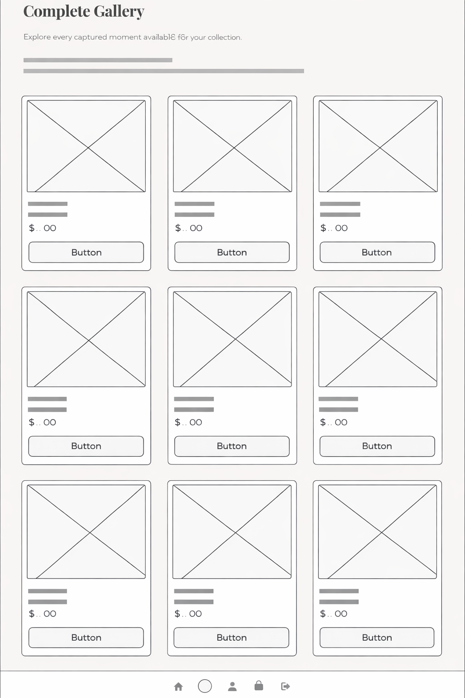 | 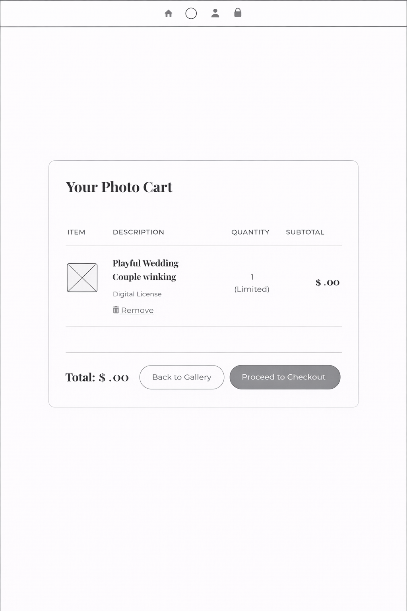 |

#### **Checkout & Error Handling**
The checkout process was designed as a focused, secure flow, while the 404 page was styled to maintain brand consistency even during navigation errors.

| Stripe Checkout | 404 "Lost in Frame" |
|:---:|:---:|
| 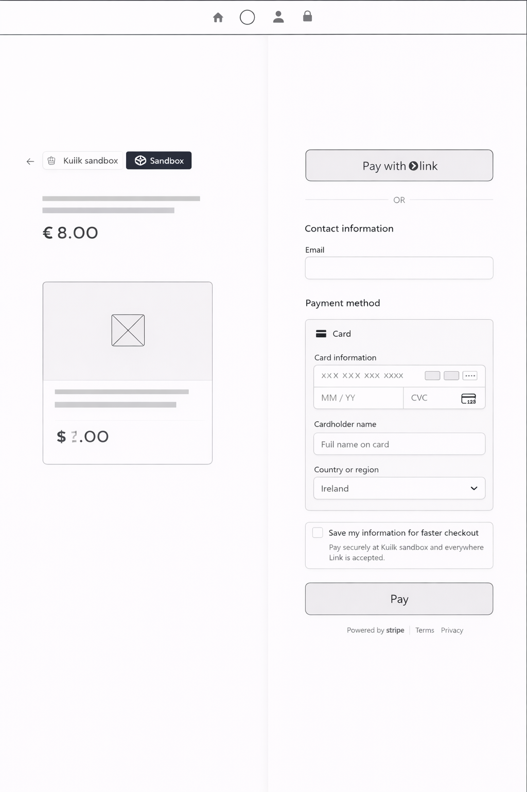 | 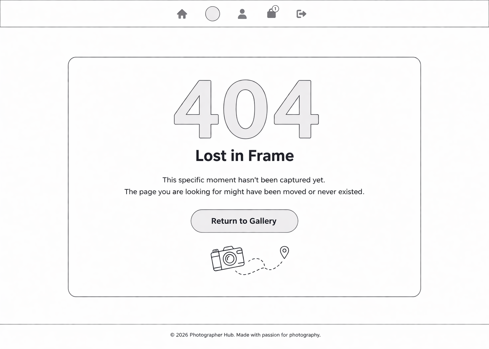 |

#### **Photographer Management (Dashboard)**
For administrative tasks, the layout emphasizes high functionality, allowing the owner to manage the entire shop and photoshoot schedule from a centralized hub.

| Management Dashboard | Add Photo Form |
|:---:|:---:|
| 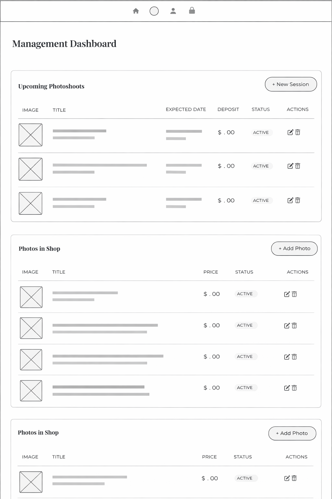 | 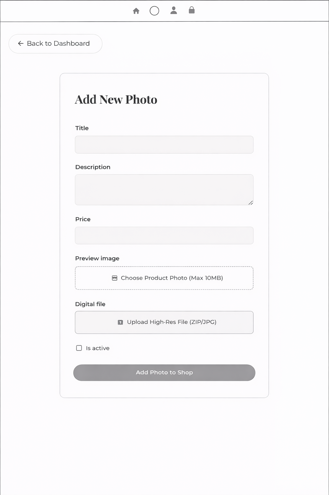 |

---

### **Typography**

The typography is a strategic pairing of Serif and Sans-Serif fonts, balancing classic editorial elegance with modern functional clarity.

* **Primary Font (Headings):** **'Playfair Display'** (Serif). 
    * Applied to all `h1`, `h2`, `h3`, and special `.serif-title` elements. 
    * The high-contrast serif style provides a high-end, artistic feel typical of fine art publications.
* **Secondary Font (Body Content):** **'Montserrat'** (Sans-Serif). 
    * The primary font for general site content, descriptions, and UI labels. 
    * Chosen for its geometric clarity and excellent readability across all devices.
* **UI & Form Font:** **'Inter'** (Sans-Serif). 
    * Specifically used for form inputs and textareas. 
    * Provides a clean, neutral, and highly functional interface for user data entry tasks.

### **Enhanced Interaction (JavaScript)**

To elevate the user experience beyond static HTML/CSS, several custom JavaScript modules were implemented to provide a dynamic and responsive interface:

* **Defensive Programming (Custom Modals):** * A bespoke deletion modal was created to replace standard browser alerts. 
    * It handles all **CRUD confirmation requests** (Cart and Dashboard) to ensure a consistent brand look and prevent accidental data loss.
* **Dynamic Feedback (Toast Notifications):** * Real-time feedback for user actions, such as adding items to the cart or successful login/logout.
    * These custom-styled Toasts provide non-intrusive alerts that automatically hide after **5 seconds**.
* **Immersive Viewing (GLightbox):** * The **GLightbox** library is integrated to showcase photography in its best possible light. 
    * This allows users to view high-resolution versions of digital art in a responsive, touch-friendly lightbox with zoom capabilities.

---

# Structure

## Website Pages
The application is structured to provide a seamless transition between public content and private user areas. The following table outlines the primary pages, their purpose, and the logic governing their access.

| Page | Description | Desktop | Tablet | Mobile |
|:---|:---|:---:|:---:|:---:|
| **Home** | Hero section with photographer bio, featured products scroller, and upcoming sessions. |   |   |    |
| **Shop Gallery** | A grid of all active digital photo products with ownership-aware "Add to Cart" logic. |  |  |    |
| **Session Details** | Detailed concept description, expected dates, and deposit payment for photoshoots. |  |  |  |
| **Shopping Cart** | Overview of selected items with session-based quantity adjustment for sessions. |  |   |  |
| **User Profile** | Personal dashboard showing the digital library of purchased photos and active bookings. |  |  |   |
| **Admin Dashboard** | Central management hub for the photographer to perform full CRUD on products and sessions. |  |   |  | |

---

## Database Design

### Data Model

Entity Relationship Diagrams (ERD) help to visualize database architecture before creating models. Understanding the relationships between different tables ensures data integrity and a smooth development process.


I have used `Mermaid` to generate an interactive ERD that represents the relational structure of the **Photographer Hub** database.

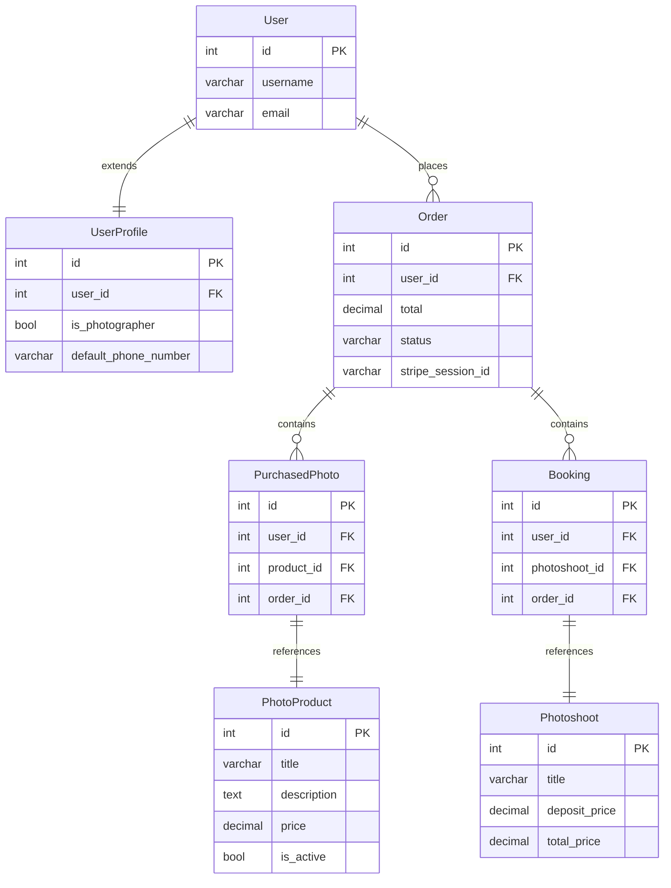
```mermaid
erDiagram
    User {
        int id PK
        varchar username
        varchar email
    }

    UserProfile {
        int id PK
        int user_id FK
        bool is_photographer
        varchar default_phone_number
    }

    User ||--|| UserProfile : extends

    PhotoProduct {
        int id PK
        varchar title
        text description
        decimal price
        bool is_active
    }

    Photoshoot {
        int id PK
        varchar title
        decimal deposit_price
        decimal total_price
    }

    Order {
        int id PK
        int user_id FK
        decimal total
        varchar status
        varchar stripe_session_id
    }

    PurchasedPhoto {
        int id PK
        int user_id FK
        int product_id FK
        int order_id FK
    }

    Booking {
        int id PK
        int user_id FK
        int photoshoot_id FK
        int order_id FK
    }

    User ||--o{ Order : places
    Order ||--o{ PurchasedPhoto : contains
    Order ||--o{ Booking : contains
    PurchasedPhoto ||--|| PhotoProduct : references
    Booking ||--|| Photoshoot : references
```
Source: [Interactive Mermaid Diagram](https://mermaid.ai/live/edit#pako:eNqlVNtu4jAQ_RXLz4By4dLmbRfoUnW1QVxeVkiRGw-JJSfO2s4uXeDf6yQECFBUqXnKzJyZcyYzky0OBQXsYZAjRiJJklWKzLOcj2dot2u3d7vyfTrzn55_jpGHVjgmaoUvYGKL_NnIGAUg4ySEm5jpcjacfJuPR9OJv_BLsPiX3oR-9_2X518_SoyEiCkNsgRW0LJA28gaLYeLO-U5CyFVQNFJdBmcT3x_cYtLhTHQnB8zqpyquY9p1jlfM86PHA18ozyEuYSzymXP2-q9eFiqEaNo-nJyKS1ZGqFcgUxJAlcBSAjjlXd_KlqP7KJ2USUwBE9nBK9CcMRUkMVCC7MEWQzyLCshEaBMCtMhBKV1CmrYaPTKRIO-OZxPNaeZ5mdlKYSGiBtWM7-Tu1CAKIuYJjwojOseSKjZX7iWUw38K1ooZEIxHVxoqsNaFKIugvWENhmEGmhAiTbDPxdXbcp9XQ2Kq-JKE52rG27JMggUKMVEakbe_CbNHb7P_9HeFH6zFzQP9a2QkLSZc-Cu7-ELpMWiqliIz_HWgT85Sc1w3w5qcAtHklHsaZlDCycgzSEZE5fCVljHYK4NF2dLYU1yrouzLdIykv4WIqkzpcijGHtrwpWx8qyY8uF3eoRAakQNRZ5q7NmuVdbA3hZvsOc4Vqc7cF2r7zz2BvZjt4XfDMixO67r9G2nZ_Ut1-k97Fv4f8lqdQaOa3etnvvwOLBcyx7s3wHrmLN9)

### Data Modeling Architecture

* **User & UserProfile:** Utilizes a **One-to-One** relationship to extend the base Django User. The `is_photographer` flag acts as the gatekeeper, controlling access to administrative CRUD operations on the frontend.
* **Order & Stripe Integration:** The `Order` model serves as the transaction header. Metadata passed to Stripe ensures that upon a successful webhook signal, the system automatically generates the corresponding `PurchasedPhoto` or `Booking` records.
* **Defensive Deletion (Protected Records):** The relationship between `PhotoProduct` and `PurchasedPhoto` uses `models.PROTECT`. This prevents the deletion of a product that a customer has already purchased; instead, the system triggers a "deactivation" (hiding it from the shop) to preserve historical records.
* **Session-Based Cart:** The shopping cart logic is managed via **Django Sessions**. This allows users to build an order without immediate database writes, optimizing performance and keeping the database clean from abandoned carts.


---

## Technologies Used
* **Languages:** HTML5, CSS3, JavaScript, Python.
* **Framework:** Django (5.2).
* **Database:** PostgreSQL.
* **Payments:** Stripe API.
* **Media Storage:** Cloudinary.
* **Email/Newsletter:** MailChimp.

---

## 6. Marketing Strategy

To ensure a steady flow of clients and brand recognition, the platform employs a strategic marketing approach focusing on visual storytelling and community engagement.

### Social Media Marketing

Facebook is the cornerstone of the project's social media presence. It is chosen for its strong community features and its popularity among the target audience (families, couples, and wedding planners). 

#### Conceptual Design & Prototyping
The visual identity on social media was prototyped using **Balsamiq Cloud** (based on the Code Institute mockup template). This ensured that the photographer's brand message is delivered clearly through a cohesive layout.

* **Visual Consistency:** The profile uses a signature "camera-in-hand" avatar to establish a professional yet personal connection.
* **Clear Value Proposition:** The bio emphasizes the photographer's niche: *Specializing in lifestyle family, children, and wedding photography.*
* **Portfolio Showcasing:** Strategic use of the "Photos" grid and "Posts" allows for immediate exposure to recent works, emphasizing soft light and genuine emotive connections.

[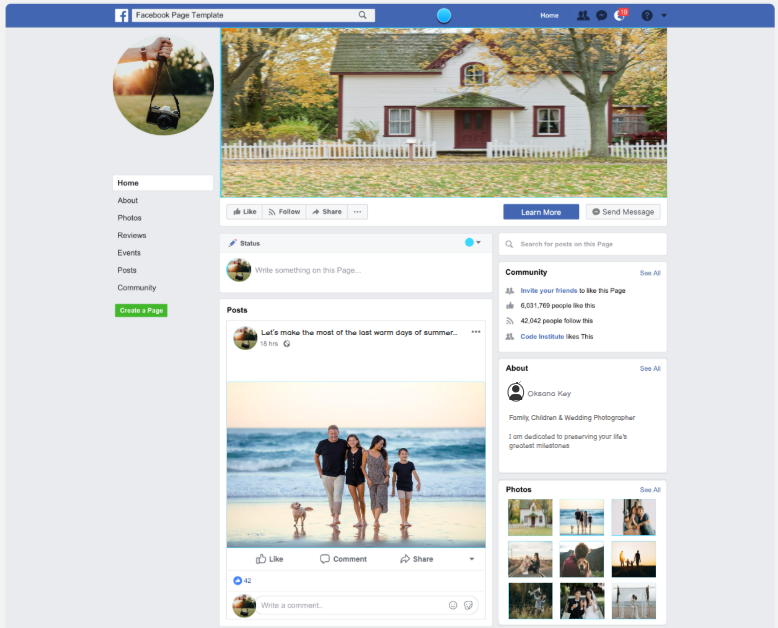](docs/mockups/facebook_1.png)
*Figure: Facebook Page Mockup - Profile and Cover overview.*

[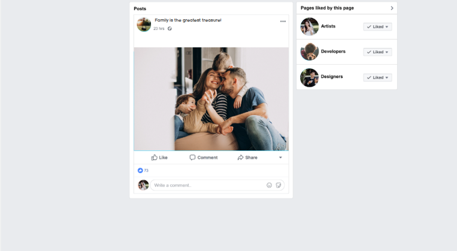](docs/mockups/facebook_2.png)
*Figure: Facebook Page Mockup - Post engagement and community links.*

#### Brand Message
> "I am dedicated to preserving your life's greatest milestones. Inspired by soft light and genuine connection, my goal is to create authentic, emotive, and timeless imagery that speaks to your heart for generations to come." — **Oksana Key**

---

Email Marketing (Mailchimp Integration)
To build a loyal community, the site features a built-in newsletter system integrated with the **Mailchimp API**.

* **Content Strategy:** Subscribers receive exclusive photography tips, early-bird notifications for upcoming thematic photoshoot sets, and "behind-the-scenes" insights.
* **Subscription Points:**
    1.  **Global Footer:** A minimalist AJAX-ready form available on every page.
    2.  **Registration Opt-in:** A checkbox on the Sign-Up page allowing new users to join the marketing list during account creation.
* **Implementation:** The system uses the `mailchimp3` library to synchronize user data with the Mailchimp Audience API, ensuring automated lead generation.

### Account Verification & Security (Django SMTP)
To ensure the platform's integrity and protect user data, the project implements a mandatory email verification process.

* **Process:** Upon registration, Django (via `django-allauth`) generates a unique, time-sensitive confirmation link. 
* **Access Control:** Users are restricted from accessing private dashboard features until their email address is verified, preventing bot registrations and ensuring a valid point of contact for digital photo delivery.
* **Configuration:** The system is configured with a secure SMTP backend, utilizing environment variables for credentials to ensure maximum security on the production server (Heroku).

#### Communication Implementation Proofs:

[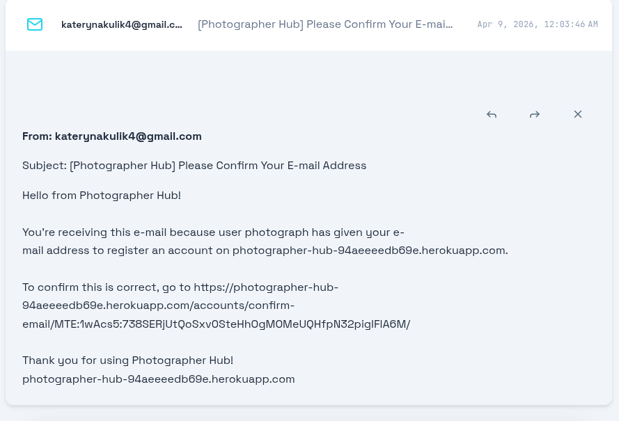](docs/screenshots/confirm_email.png)
*Figure: Automated transactional email sent via Gmail SMTP for account verification.*

[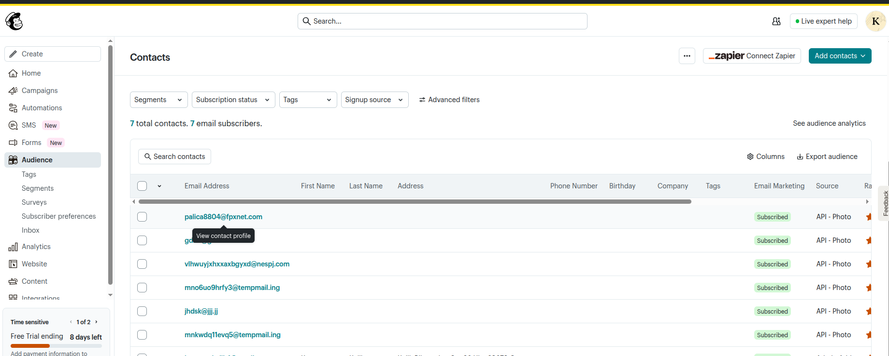](docs/screenshots/mailchimp.png)
*Figure: Mailchimp Audience Dashboard showing real-time subscriber updates synchronized via API.*

#### Marketing Implementation Proofs:

[](docs/screenshots/subscribe_form.png) <br>
*Figure: Built-in HTML5 validation for the subscription form.*

[](docs/screenshots/toast_success.png)<br>
*Figure: Custom Toast notification confirming successful API synchronization.*

[](docs/screenshots/mailchimp.png)<br>
*Figure: Mailchimp Audience Dashboard showing real-time subscriber updates via API.*

---

## SEO Implementation

The marketing strategy for **Photographer Hub** focuses on visual storytelling, high search engine visibility, and building a loyal community through direct communication.

### Keywords
I have identified a targeted list of keywords to improve organic search rankings. These keywords focus on the photographer's niche and location-based searches.

* **Short-tail keywords:** Photography, Portfolio, Wedding, Family, Lifestyle, Digital Art.
* **Long-tail keywords:** Lifestyle family photography sessions, professional wedding photographer, children's emotive portraits, buy high-resolution digital photography.

I utilized [Word Tracker](https://www.wordtracker.com) during the research phase to ensure the chosen terms have a high relevance to my target audience.

### Sitemap
To ensure efficient indexing by search engines, a `sitemap.xml` file was generated using [XML-Sitemaps](https://www.xml-sitemaps.com). 
* **Live Link:** [https://photographer-hub-94aeeeedb69e.herokuapp.com/sitemap.xml](https://photographer-hub-94aeeeedb69e.herokuapp.com/sitemap.xml)
* The sitemap is included in the root directory of the repository.

### Robots.txt
A `robots.txt` file was created to manage crawler access. It allows search engines to index product and session pages while protecting sensitive areas like the management dashboard.

```txt
User-agent: *
Disallow: /accounts/
Disallow: /photos/dashboard/
Sitemap: [https://photographer-hub-94aeeeedb69e.herokuapp.com/sitemap.xml](https://photographer-hub-94aeeeedb69e.herokuapp.com/sitemap.xml)
```
---

## Features

The **Photographer Hub** platform is designed with a "Fine Art" aesthetic, focusing on high-quality visual presentation and a seamless user experience across different roles (Guest, Client, and Photographer).

## Header & Footer
The navigation bar is dynamic and changes based on the user's authentication status and role.

* **Guest View:** Minimalist icons for Home, Facebook, and Login/Register. The shopping bag redirects to the login page to encourage conversion.
* **Client View:** Adds a link to "My Profile" and an active shopping cart with a real-time **badge notification** showing the number of items.
* **Photographer View:** Replaces commerce links with a **Management Dashboard** icon (gauge), giving the site owner immediate access to administrative tools.
* **Footer:** A simple, branded footer that stays out of the way of the visual content, featuring the signature: *"Made with passion for photography."*

[](docs/screenshots/header_gest.png)
[](docs/screenshots/header_client.png)
[](docs/screenshots/header_ph.png)
[](docs/screenshots/footer.png)

## Home Page
The landing page serves as an immersive portfolio and sales funnel:
* **Hero Section:** A centered biography of the photographer featuring a signature **oval-style avatar**, professional tagline, and mission statement.
* **Photoshoot Scroller:** A "Limited Offers" section with a custom JavaScript-powered horizontal scroller. Users can browse upcoming themes with smooth navigation arrows.
* **Featured Shop:** Automatically displays the latest 4 digital photo products, utilizing the reusable product card component.
* **Newsletter:** A "Join the Journey" section with a Mailchimp-integrated form to capture leads and notify users of new drops or sessions.

[](docs/screenshots/home_1.png)
[](docs/screenshots/home_2.png)
[](docs/screenshots/home_3.png)

## Authentication (Registration & Login)
Powered by **Django Allauth**, the system provides a secure and branded experience.
* **Registration:** A clean form that includes a pre-checked marketing consent for the newsletter.
* **Login:** Features a "Remember Me" option and intuitive redirects back to the user's previous page (e.g., the Cart).

[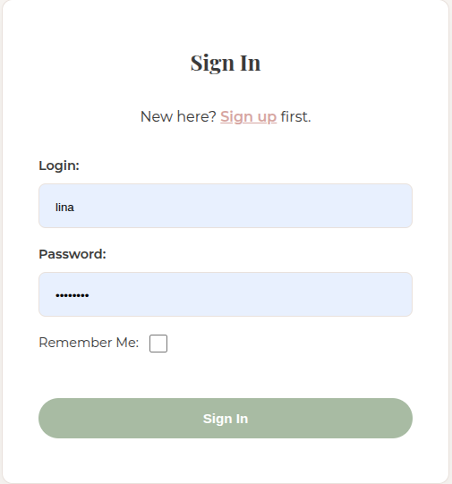](docs/screenshots/sign_in.png)
[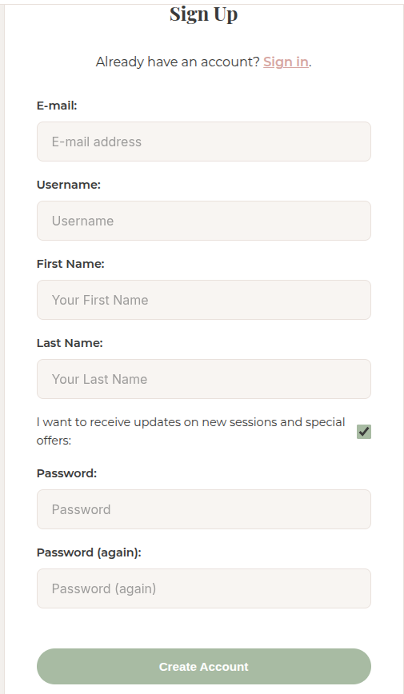](docs/screenshots/sign_up.png)

## Digital Card (Shop Gallery)
The **Product Card** is the most complex UI component, featuring extensive "Defensive Logic" to prevent invalid actions:

* **Defensive States:**
    1.  **Guest:** Displays "Login to Buy".
    2.  **Photographer:** Shows "Management Mode" (Disabled) to prevent self-purchasing and preserve data integrity.
    3.  **In Cart:** If the item is already selected, the button turns into a disabled "In Cart ✓" to prevent duplicate licenses.
    4.  **Already Owned:** If the user previously purchased the photo, the card identifies the record and shows "Already Owned," protecting the user from redundant costs.
* **Visual Interaction:** Features a "Full View" overlay that triggers the **GLightbox** for a high-resolution, watermarked preview of the art.

[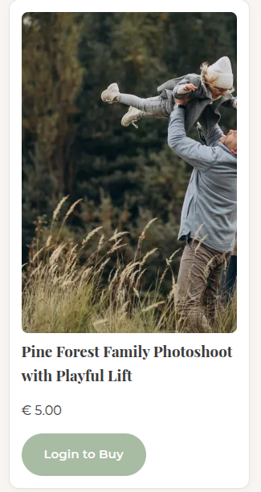](docs/screenshots/card_guest.png)
[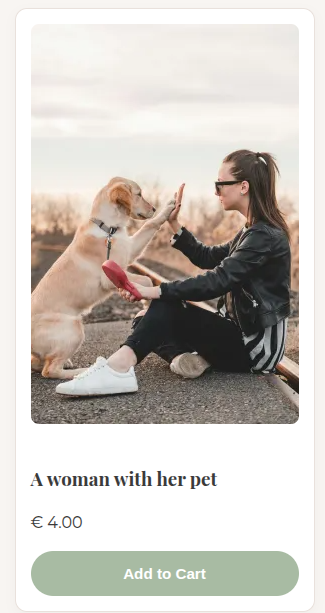](docs/screenshots/card_client.png)
[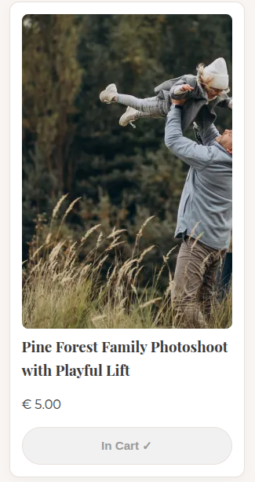](docs/screenshots/card_cart.png)
[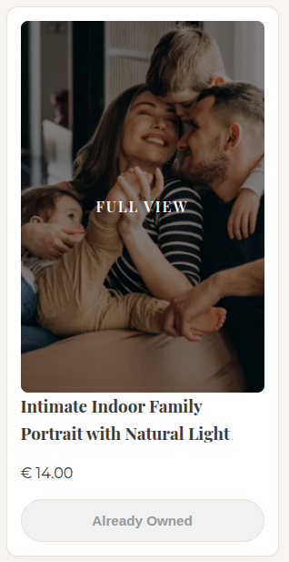](docs/screenshots/card_owned.png)
[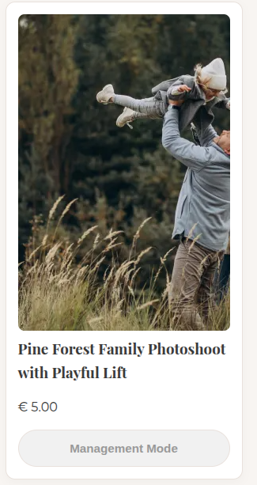](docs/screenshots/card_phot.png)

## Photoshoot Booking Selection
A specialized detail view for service offerings. Users can view the concept description, check the **Expected Dates**, and pay a **Waitlist Deposit** to secure their interest. The UI clearly highlights the deposit vs. the full value for total transparency.

[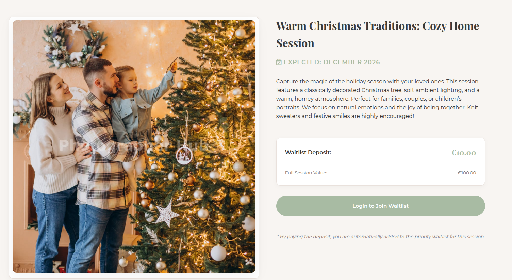](docs/screenshots/photoshoot_guest.png)
[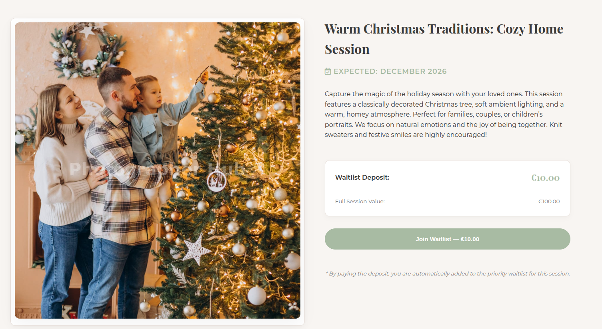](docs/screenshots/photoshoot_client.png)
[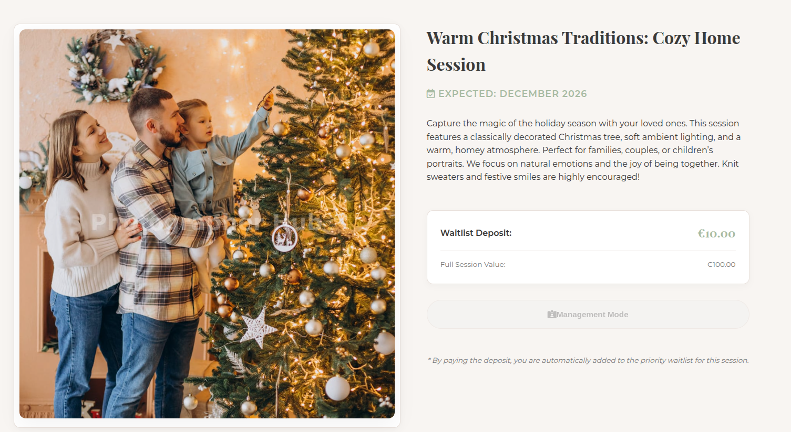](docs/screenshots/photoshoot_phot.png)

## Client Dashboard ("My Profile")
A private hub for customers to manage their digital assets and services:
* **Purchase Library:** Displays all owned digital licenses with direct "Download High-Res" buttons linking to the protected digital files.
* **Booking History:** A table-based overview of active photoshoot registrations, showing expected dates and payment status.

[](docs/screenshots/profile_1.png)
[](docs/screenshots/profile_2.png)

## Photographer Management Dashboard
An administrative command center with table-based views for all site content.
* **Session Management:** Monitor all upcoming photoshoots, their status (Active/Draft), and deposit pricing.
* **Shop Management:** Track and edit prices, status, and details of all gallery photos.

[](docs/screenshots/dash_1.png)
[](docs/screenshots/dash_2.png)

## Gallery & Session CRUD Management
The photographer has full control over the site via custom frontend forms:
* **Create/Edit Photoshoots:** Manage session images, themes, and dates.
* **Add/Update Photos:** Separate upload fields for **Preview Images** (optimized for web) and **High-Resolution Files** (for customer delivery).
* **Soft Deletion Logic:** If a photo has already been purchased, the system intelligently deactivates it (hides it from the shop) instead of deleting it, ensuring existing customers never lose access to their purchases.

[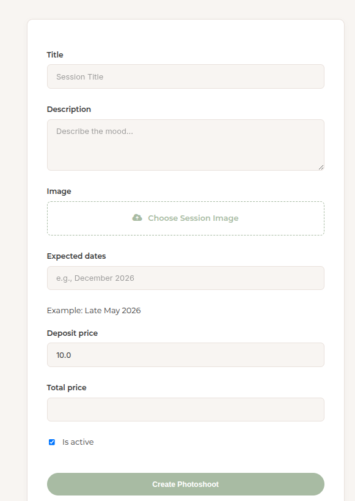](docs/screenshots/photoshoot_create.png)
[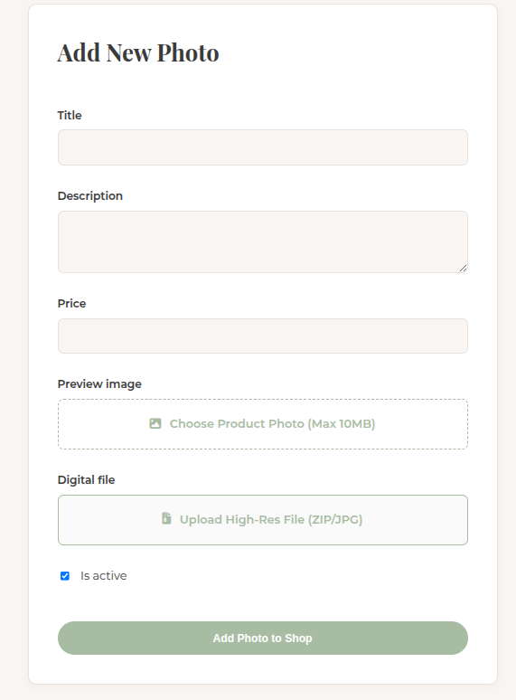](docs/screenshots/photo_create.png)
[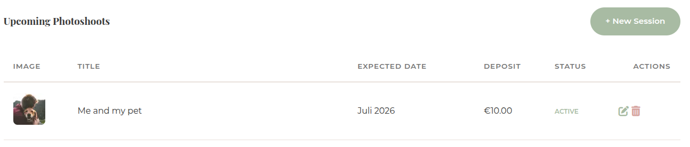](docs/screenshots/photoshoot_table.png)
[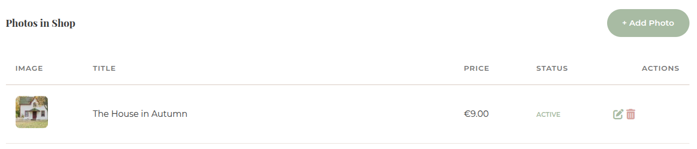](docs/screenshots/photo_table.png)

## Toast Notifications
To ensure immediate user feedback, the site implements custom-styled **Toast Notifications**. These alerts are color-coded (Sage for success, Dusty Rose for errors) and feature a JavaScript auto-hide logic (5 seconds) with a manual close override.

[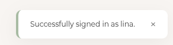](docs/screenshots/toast.png)

## Custom Error Pages (404 & 500)
To maintain the "Fine Art" aesthetic even during unexpected navigation errors, branded **404 (Not Found)** and **500 (Server Error)** pages were implemented. These pages provide clear feedback and a "Return Home" path, preventing user frustration through a professional design.

[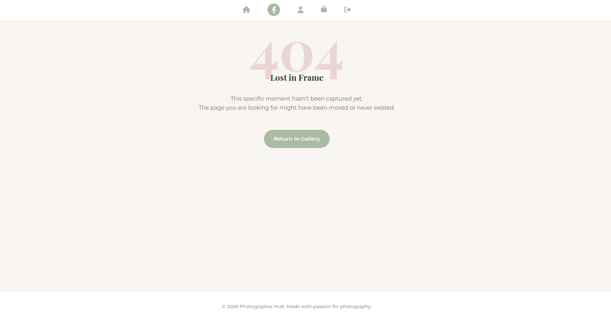](docs/screenshots/404.png)

---

## Features Overview

The platform is built around a robust set of features categorized by their business value using the MoSCoW method.

| Feature Area | Description | Implementation Detail |
| :--- | :--- | :--- |
| **E-Commerce** | Secure digital transactions. | Integrated **Stripe API** for card payments with webhook-based fulfillment. |
| **RBAC System** | Role-Based Access Control. | Custom logic within `UserProfile` model and `user_passes_test` decorators. |
| **CRUD Management** | Content administration. | Full frontend management of `PhotoProducts` and `Photoshoots` without Django Admin access. |
| **Defensive Design** | Prevention of invalid actions. | Logic to disable "Add to Cart" for owned items or restrict quantities for digital licenses. |
| **Cloud Services** | Media and File handling. | **Cloudinary** for image optimization and Django **FileField** for secure high-res digital downloads. |
| **Interaction** | Modern web experience. | Custom **Toast Notifications**, **GLightbox** for art viewing, and **Confirmation Modals**. |

---

## Validation

* **HTML:** Checked via W3C Markup Validator.
* **CSS:** Validated via Jigsaw Service.
* **JavaScript:** ES6 compliant, checked via JSHint.
* **Python:** 100% PEP8 compliance across all apps.
* **Lighthouse:** High scores (90+) in Accessibility and Best Practices.

### HTML Validation

I have used the recommended [HTML W3C Validator](https://validator.w3.org) to validate all of my HTML files. Every page has been tested by URL to ensure that dynamic Django content also adheres to HTML5 standards.

| Directory | File | Validation Link | Screenshot | Notes |
| --- | --- | --- | --- | --- |
| home | [home.html](https://github.com/Katerynakulik/photographer_hub/blob/main/home/templates/home/index.html) | [W3C Link](https://validator.w3.org/nu/?doc=https%3A%2F%2Fphotographer-hub-94aeeeedb69e.herokuapp.com%2F) | 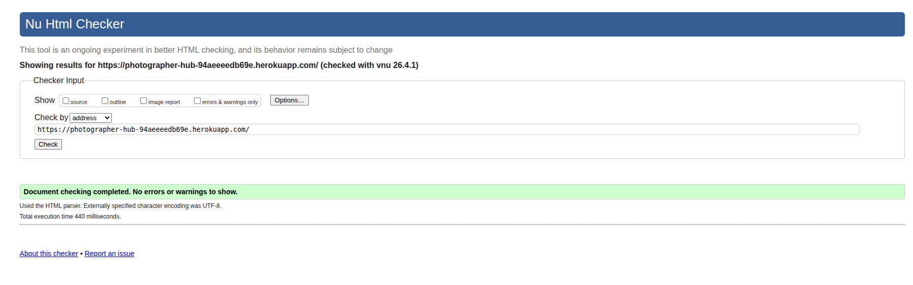 | **Pass** - No errors |
| products | [products_list.html](https://github.com/Katerynakulik/photographer_hub/blob/main/products/templates/products/products_list.html) | [W3C Link](https://validator.w3.org/nu/?doc=https%3A%2F%2Fphotographer-hub-94aeeeedb69e.herokuapp.com%2Fphotos%2Fall%2F) | 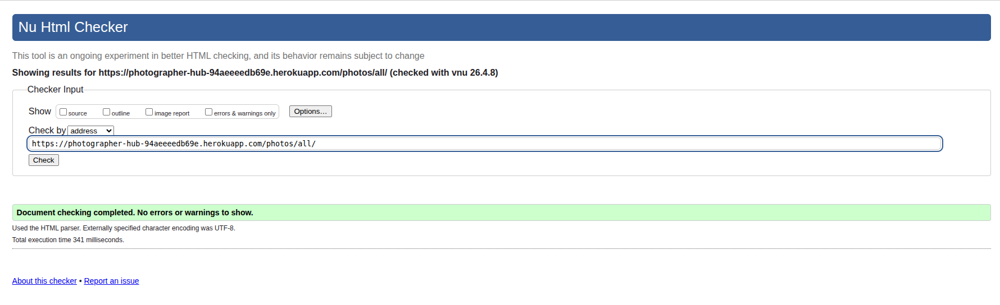 | **Pass** - Fixed unclosed div |
| products | [photoshoot_detail.html](https://github.com/Katerynakulik/photographer_hub/blob/main/products/templates/products/photoshoot_detail.html) | [W3C Link](https://validator.w3.org/nu/?doc=https%3A%2F%2Fphotographer-hub-94aeeeedb69e.herokuapp.com%2Fphotos%2Fphotoshoot%2F1%2F) | 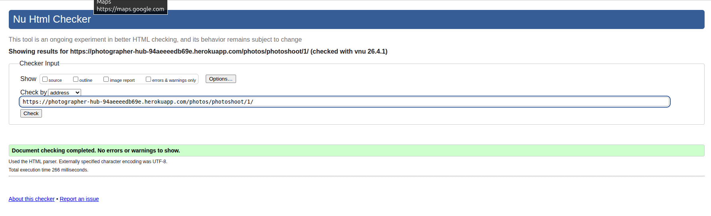 | **Pass** - Fixed nested p tags |
| cart | [cart.html](https://github.com/Katerynakulik/photographer_hub/blob/main/cart/templates/cart/cart.html) | [W3C Link](https://validator.w3.org/nu/?doc=https%3A%2F%2Fphotographer-hub-94aeeeedb69e.herokuapp.com%2Fcart%2F) |  | **Pass** - No errors |
| profiles | [profile.html](https://github.com/Katerynakulik/photographer_hub/blob/main/profiles/templates/profiles/profile.html) | [W3C Link](https://validator.w3.org/nu/?doc=https%3A%2F%2Fphotographer-hub-94aeeeedb69e.herokuapp.com%2Fprofile%2F) | 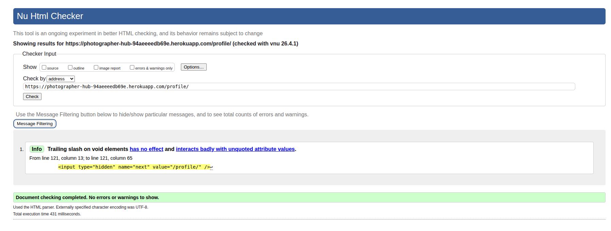 | **Pass** - No errors |
| products | [dashboard.html](https://github.com/Katerynakulik/photographer_hub/blob/main/products/templates/products/dashboard.html) | [W3C Link](https://validator.w3.org/nu/?doc=https%3A%2F%2Fphotographer-hub-94aeeeedb69e.herokuapp.com%2Fphotos%2Fdashboard%2F) | 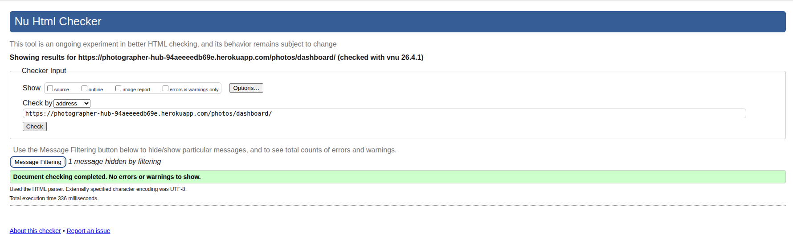 | **Pass** - No errors |
| products | [photoshoot_form.html](https://github.com/Katerynakulik/photographer_hub/blob/main/products/templates/products/photoshoot_form.html) | [W3C Link](https://validator.w3.org/nu/?doc=https%3A%2F%2Fphotographer-hub-94aeeeedb69e.herokuapp.com%2Fphotos%2Fdashboard%2Fadd-session%2F) |  | **Pass** - Management mode |
| products | [product_form.html](https://github.com/Katerynakulik/photographer_hub/blob/main/products/templates/products/product_form.html) | [W3C Link](https://validator.w3.org/nu/?doc=https%3A%2F%2Fphotographer-hub-94aeeeedb69e.herokuapp.com%2Fphotos%2Fdashboard%2Fadd-photo%2F) | 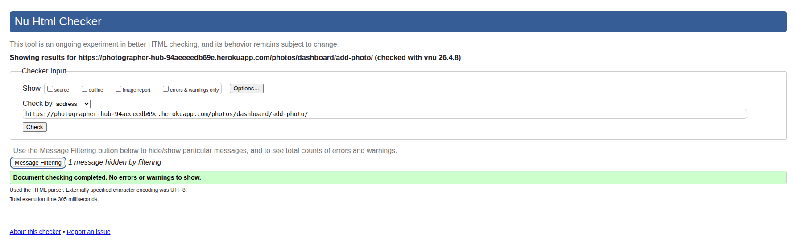 | **Pass** - Management mode |
| account | [login.html](https://github.com/Katerynakulik/photographer_hub/blob/main/templates/account/login.html) | [W3C Link](https://validator.w3.org/nu/?doc=https%3A%2F%2Fphotographer-hub-94aeeeedb69e.herokuapp.com%2Faccounts%2Flogin%2F) | 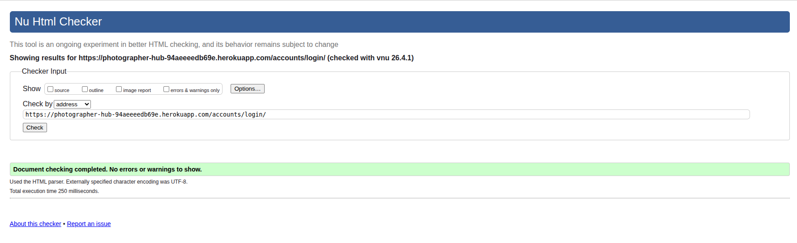 | **Pass** - No errors |
| checkout | [success.html](https://github.com/Katerynakulik/photographer_hub/blob/main/checkout/templates/checkout/success.html) | [W3C Link](https://validator.w3.org/nu/?doc=https%3A%2F%2Fphotographer-hub-94aeeeedb69e.herokuapp.com%2Fcheckout%2Fsuccess%2F%3Fsession_id%3Dcs_test_a1gNjzHdAfTvtu6WvwgdSJp9GGlKasGu2svQHDnDseThLhfriTmuD4AOpj) | 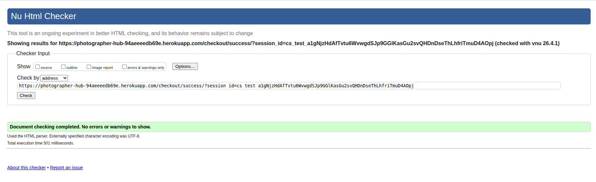
| 404 Error | [404.html](https://github.com/Katerynakulik/photographer_hub/blob/main/templates/404.html) | N/A | 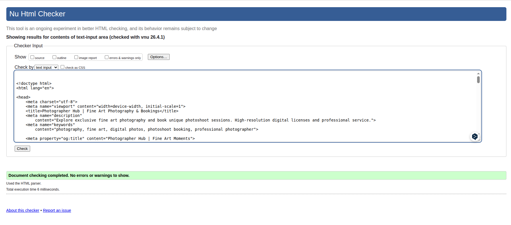 | **Pass** - Custom error page |

---

### CSS Validation

The project's visual identity is managed through a single, comprehensive stylesheet (`style.css`). This file was validated using the [W3C Jigsaw CSS Validation Service](https://jigsaw.w3.org/css-validator/) to ensure full compatibility with modern browsers and CSS3 standards.

* **Status:** **Pass** (No errors found).
* **Validation Method:** Validation by URI (Heroku production static file).
* **Key Observations:**
    * The validator confirmed that the custom CSS variables (`:root` tokens) and Flexbox/Grid layouts are correctly implemented.
    * A few warnings were noted regarding vendor prefixes (e.g., `-webkit-user-drag`), which are necessary for cross-browser consistency and do not impact the code's validity.
    * The use of a single CSS file allowed for better optimization and faster loading times, as confirmed by Lighthouse metrics.

[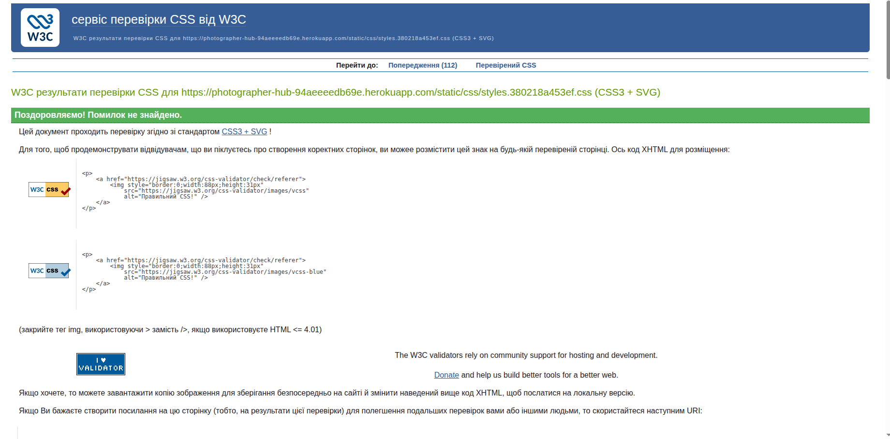](docs/validation/css_val.png)
*Figure: Official W3C CSS Validation result showing 0 errors for the main stylesheet.*

---

### JavaScript Validation (JSHint)

The custom JavaScript logic responsible for UI interactions (scrollers, modals, toasts) was validated using [JSHint](https://jshint.com/).

* **Status:** **Pass** (with ES6 configuration).
* **Notes on Warnings:** The initial validation reported several warnings regarding ES6 syntax (`const`, `let`, arrow functions). These were confirmed as intentional, as the project targets modern browsers. To align the validator, the `/* jshint esversion: 6 */` flag was used.
* **External Libraries:** The warning for `GLightbox` being undefined is expected, as this library is loaded via a CDN in the base template and is globally available at runtime.

#### Code Metrics Summary:
| Metric | Value |
| :--- | :--- |
| **Total Functions** | 14 |
| **Largest Function** | 24 statements |
| **Max Cyclomatic Complexity** | 7 (Custom Deletion Modal logic) |
| **Undefined Variables** | 1 (`GLightbox` - External Library) |

#### JS Features Implemented:
1.  **Upcoming Sessions Scroller:** Smooth horizontal scrolling with dynamic button opacity based on scroll position.
2.  **Custom Deletion Modal:** A reusable, accessible modal that intercepts delete actions for both forms (Dashboard) and links (Cart).
3.  **Toast System:** Automated notifications with a 5-second auto-hide timer and manual "close" override.
4.  **File Input Enhancement:** Real-time feedback for file uploads, displaying the selected filename in custom-styled buttons.
5.  **Gallery Lightbox:** High-performance image viewing via the GLightbox library.

[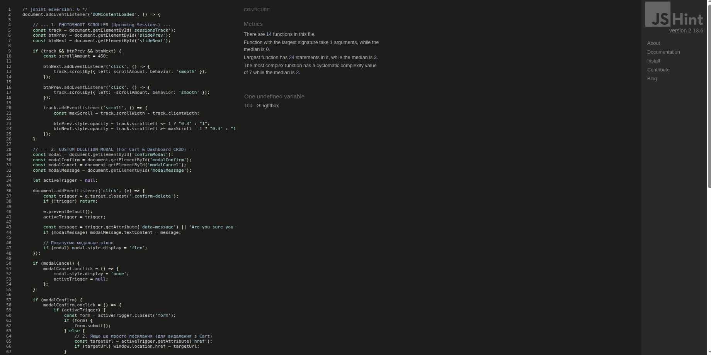](docs/validation/js_val_1.png)
[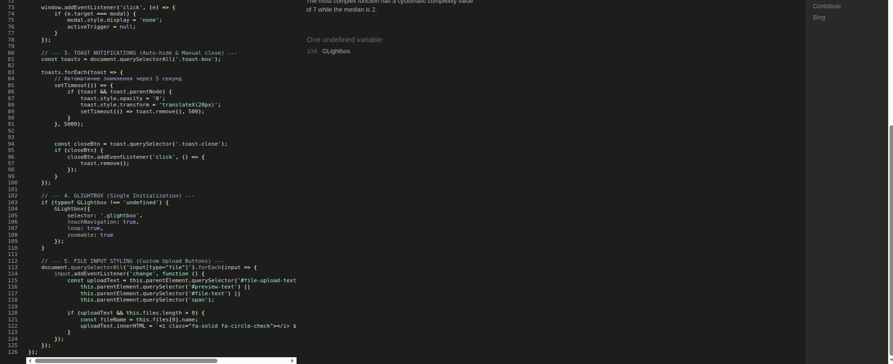](docs/validation/js_val_2.png)
---


---

### Python (PEP8) Validation

All custom Python logic was strictly validated using the **Flake8** linting tool. To ensure the audit focused exclusively on original code, a `.flake8` configuration was used to exclude the virtual environment (`.venv`), auto-generated Django files (`migrations`), and the main `settings.py`.

#### Modern Coding Standards (Line Length Policy)
While the original PEP8 style guide suggests a strict limit of 79 characters per line, this project follows the **modern industry standard of 120 characters**. 
- **Readability:** Modern high-resolution monitors allow for wider code blocks without sacrificing legibility. 
- **Django Specifics:** Django’s descriptive naming conventions for model fields, long import paths, and nested dictionary structures within form widgets (e.g., `forms.py`) often make the 79-character limit counter-productive, leading to awkward and fragmented code. 
- **Efficiency:** Setting the limit to 120 characters allows the code to maintain its logical flow while remaining concise and accessible.

#### Outcome
- **Status:** **Pass** (0 PEP8 violations found in custom apps).

#### Code Refactoring Highlights
- **Logic Integrity:** Fixed a critical missing `ValidationError` import in `products/forms.py` that was identified during the linting process.
- **Clean Workspace:** Removed multiple unused imports (`F401`) and redundant redefinitions (`F811`) across the `checkout`, `cart`, and `marketing` apps to optimize performance and readability.
- **Resource Optimization:** Eliminated unused local variables (`F841`) in `cart/contexts.py` and exception handlers in `webhooks.py`.
- **Formatting Standards:** Standardized all file terminations (`W292`, `W391`) and resolved trailing whitespaces (`W291`) for a professional, clean code finish.
- **Readability:** Refactored logic segments that exceeded even the 120-character limit, such as long success messages in `views.py` and complex widget attributes in `forms.py`.

| Tool | Purpose | Result |
| :--- | :--- | :--- |
| **Flake8** | Style guide enforcement (Max Line: 120) | **Pass** |
| **Autopep8** | Automated formatting & Indentation | Applied |

[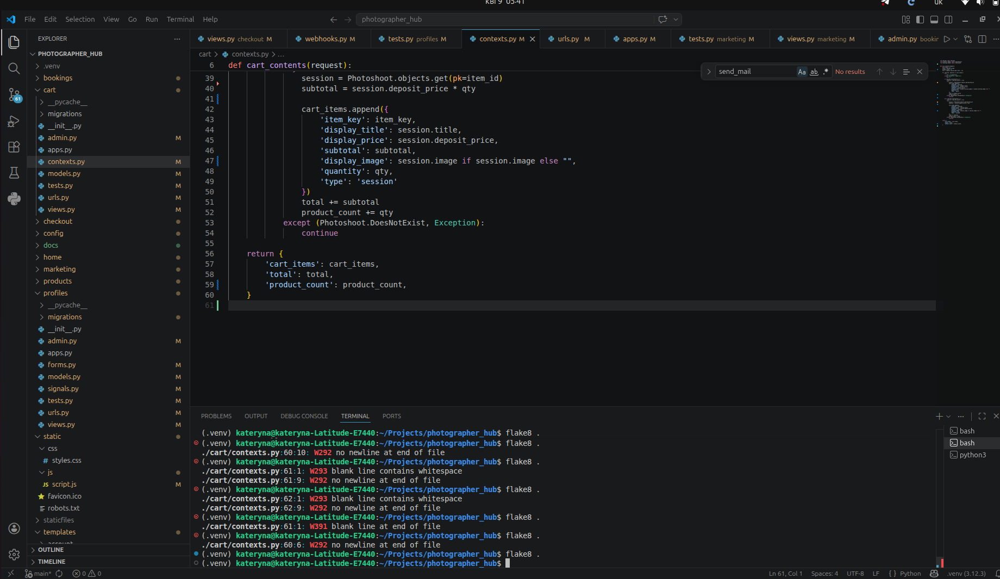](docs/validation/pep8_val.png)
*Figure: Terminal output confirming zero PEP8 violations across custom Python modules.*

---

### Lighthouse Audit

I have tested the deployed project using the Google Lighthouse Audit tool to ensure high standards of performance, accessibility, and SEO. While Heroku's dynamic hosting can occasionally impact performance scores, the overall results demonstrate a fast and accessible user experience.

| Page | Mobile | Desktop |
| :--- | :---: | :---: |
| **Home** | 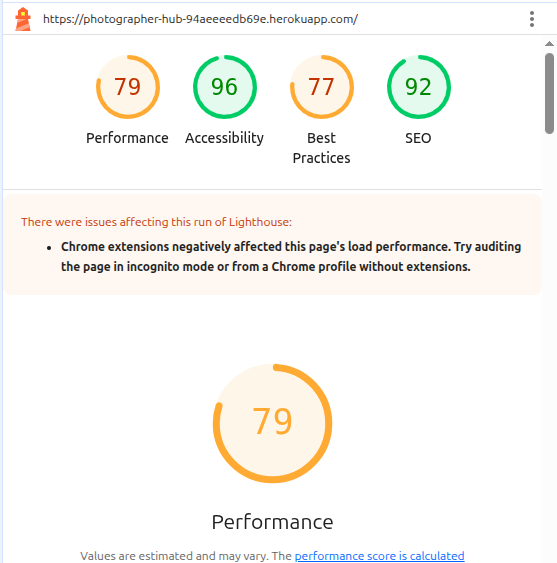 | 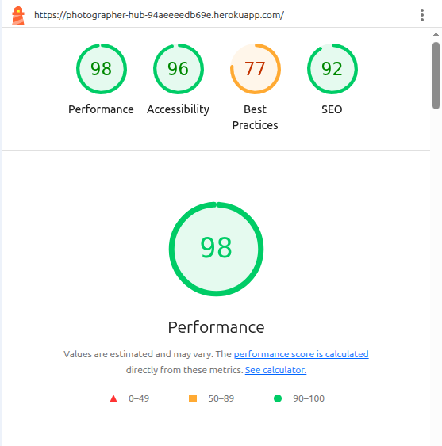 |
| **Gallery (All Products)** | 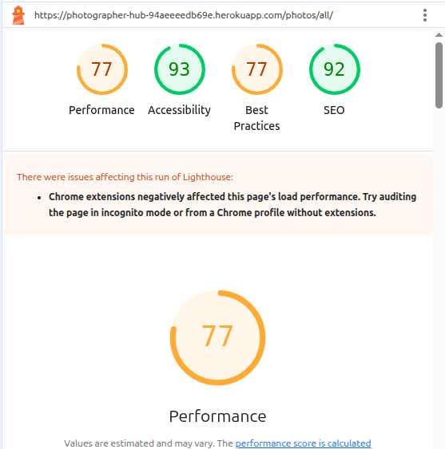 | 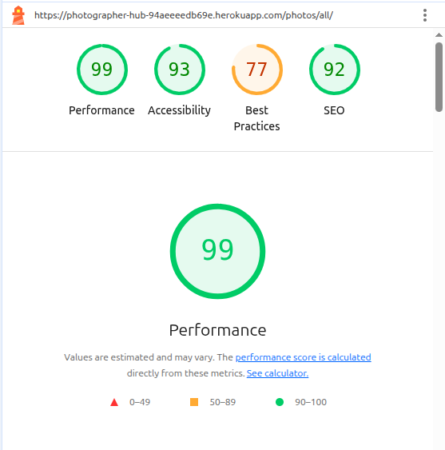 |
| **Photoshoot Details** | 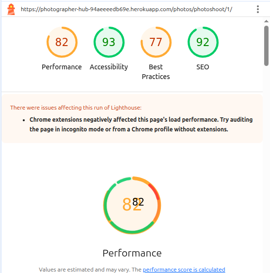 | 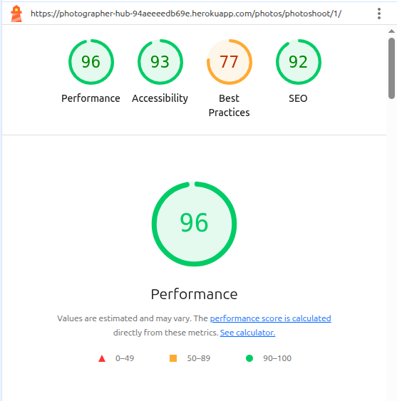 |
| **Shopping Cart (Bag)** | 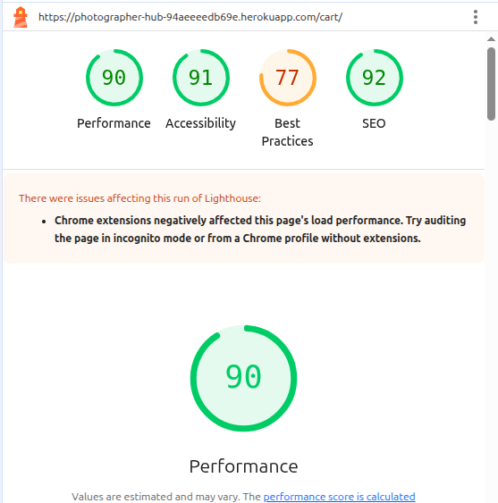 | 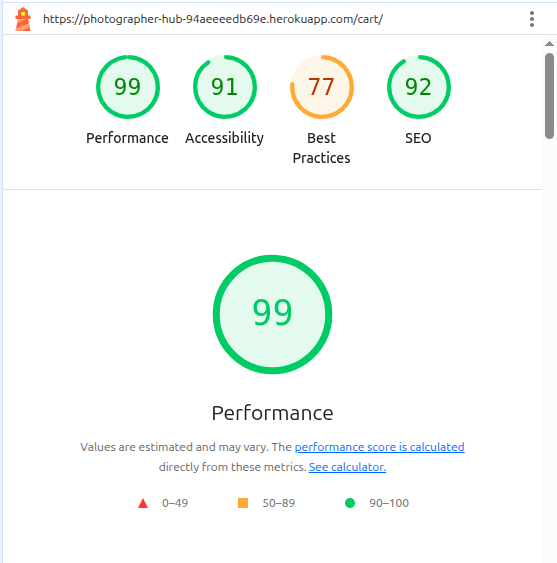 |
| **Register (Sign Up)** | 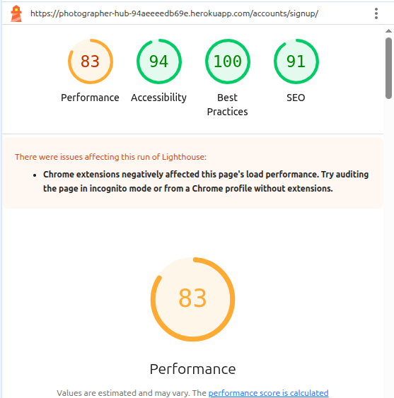 | 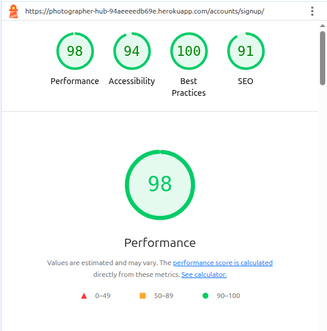 |
| **Login** | 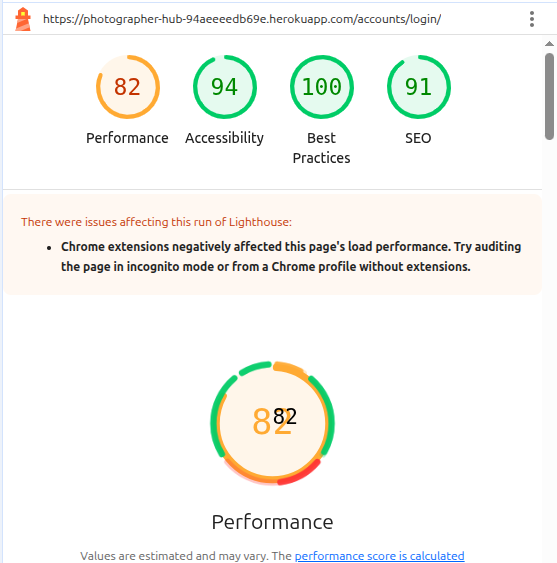 | 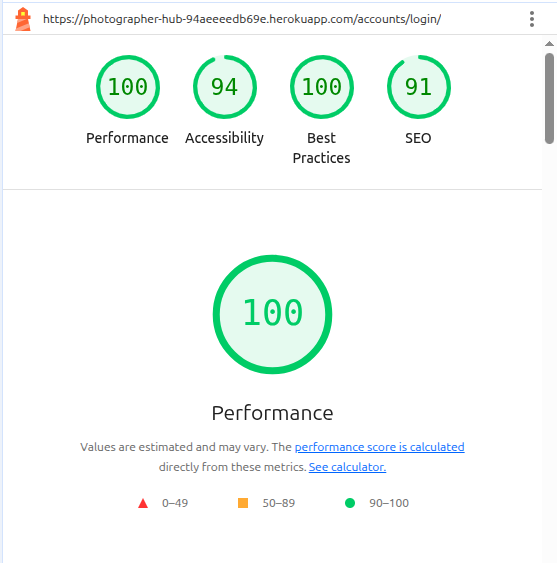 |
| **User Profile** | 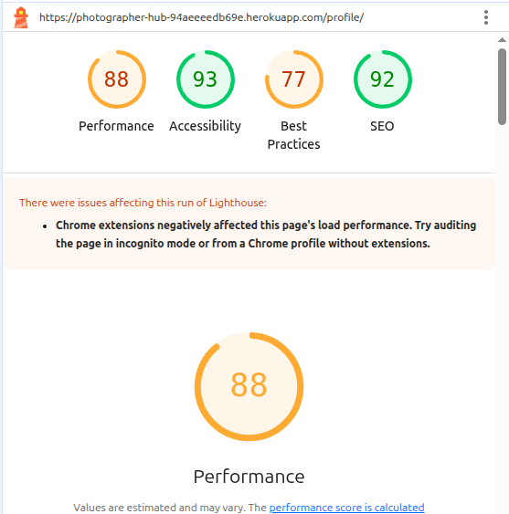 | 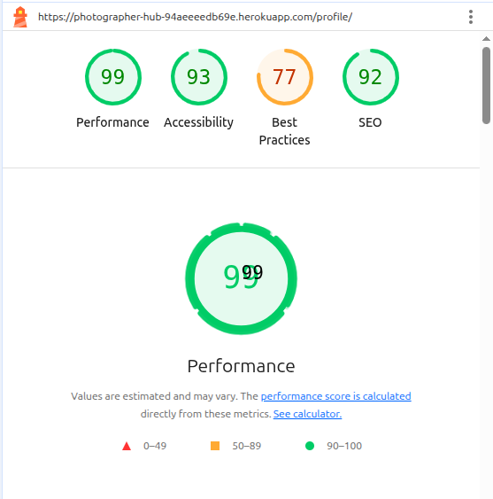 |
| **Management Dashboard** | 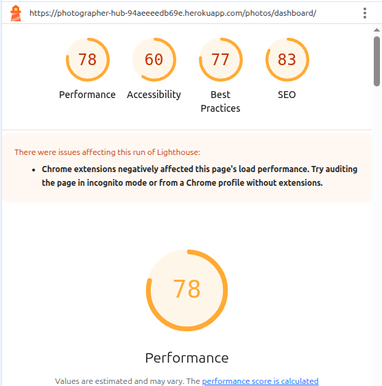 | 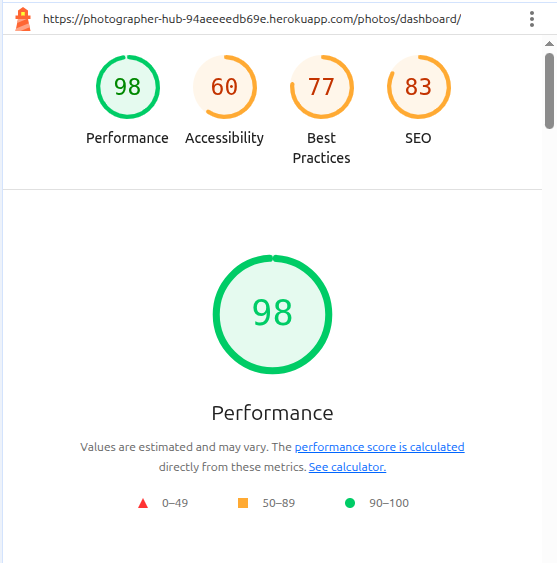 |
| **Checkout Success** | 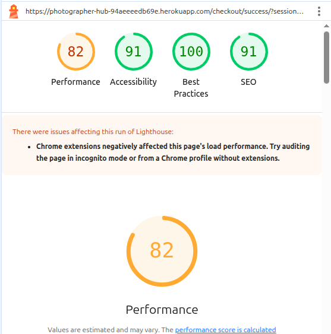 | 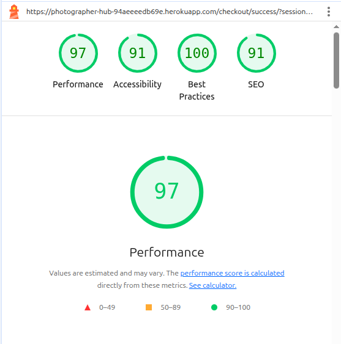 |


#### Key Audit Insights:
* **Accessibility:** Most pages achieved scores above 90, thanks to the use of semantic HTML5 elements and high contrast ratios.
* **Performance:** Desktop scores are exceptionally high (up to 99). Mobile scores reflect standard Heroku latency but remain in the "Good" range.
* **Best Practices:** Secured scores of 100 on multiple pages, confirming proper HTTPS usage and secure API connections (Stripe/Cloudinary).
* **SEO:** Consistent scores of 90+ achieved through proper meta tags and a logical heading hierarchy.

---

## Testing

### Manual Testing

I have performed extensive manual testing across the entire platform to ensure that every feature, from user authentication to complex Stripe transactions and management tools, functions as intended.
---
#### Authentication & Profile Management
| Feature | Action | Expected Result | Actual Result | Visual Reference |
| :--- | :--- | :--- | :---: | :--- |
| **User Registration** | Fill out the Sign-Up form and submit. | Account created, unique confirmation link sent to email. | Pass |  |
| **Email Verification** | Click the link received in the inbox. | User redirected to login with a "Verified" success toast. | Pass |  |
| **Login Logic** | Enter valid credentials. | User logged in, redirected to home/profile page. | Pass |  |
| **Profile View** | Navigate to the Profile page. | Displays user-specific details and history of purchased photos. | Pass |  |
| **Role-Based Access** | Log in as a Photographer. | "Management Mode" button and Dashboard link become visible. | Pass |  |
| **Logout** | Click the Logout button. | User session ended, redirected to home with success toast. | Pass |  |
---
#### Public Browsing & User Experience
| Feature | Action | Expected Result | Actual Result | Visual Reference |
| :--- | :--- | :--- | :---: | :--- |
| **Horizontal Scroller** | Click arrows on the "Upcoming Sessions" track. | Smooth scroll through upcoming photoshoots. | Pass |  |
| **Gallery Filtering** | Navigate to "Complete Gallery". | Displays only active `PhotoProduct` items. | Pass |  |
| **Lightbox View** | Click on a gallery image. | GLightbox opens image in high resolution with zoom tools. | Pass | 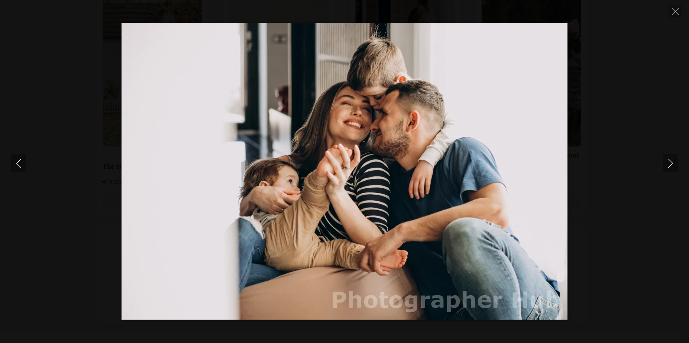 |
| **404 Custom Page** | Enter a non-existent URL. | Custom branded "Lost in Frame" page is displayed. | Pass |  |
| **Toast Alerts** | Any CRUD action or state change. | Modern, non-intrusive notification appears for 5 seconds. | Pass |  |
---
#### Shopping Cart & Stripe Payments
| Feature | Action | Expected Result | Actual Result | Visual Reference |
| :--- | :--- | :--- | :---: | :--- |
| **Add Photo to Cart** | Click "Add to Cart" on a digital product. | Item added to session-based cart, badge updates. | Pass |  |
| **Waitlist Deposit** | Click "Join Waitlist" for a photoshoot. | Deposit amount added to cart as a "Session" type. | Pass |  |
| **Duplicate Prevention** | Try to add an already purchased photo. | Button is disabled; text says "Already Owned". | Pass |  |
| **Cart Management** | Click "Remove" in the cart view. | Bespoke Modal asks for confirmation before removal. | Pass |  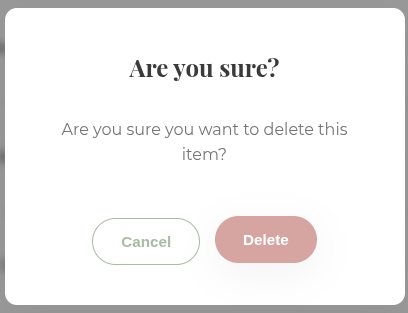|
| **Stripe Checkout** | Proceed to payment and enter test card. | Redirected to Stripe Sandbox; payment processed securely. | Pass | 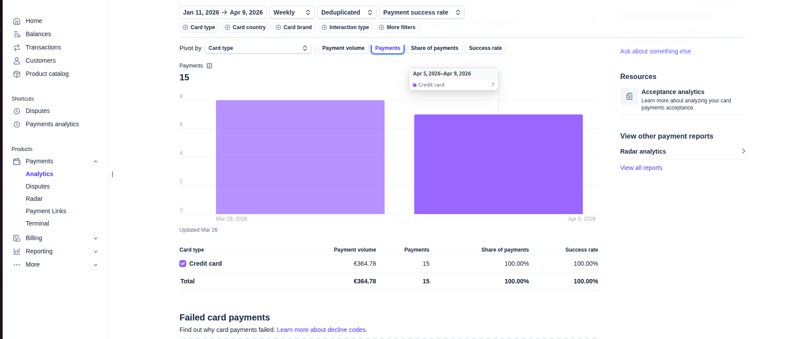 |
| **Post-Purchase Logic** | View gallery after a successful payment. | Purchased photo now has a "Download" button instead of "Buy". | Pass |  |
---
#### Management Dashboard (Photographer Role)
| Feature | Action | Expected Result | Actual Result | Visual Reference |
| :--- | :--- | :--- | :---: | :--- |
| **Dashboard Stats** | Open Dashboard as Photographer. | Real-time counts for bookings and product sales are visible. | Pass |  |
| **Add Product** | Submit "Add New Photo" form. | Photo uploaded to Cloudinary, appears in gallery immediately. | Pass |   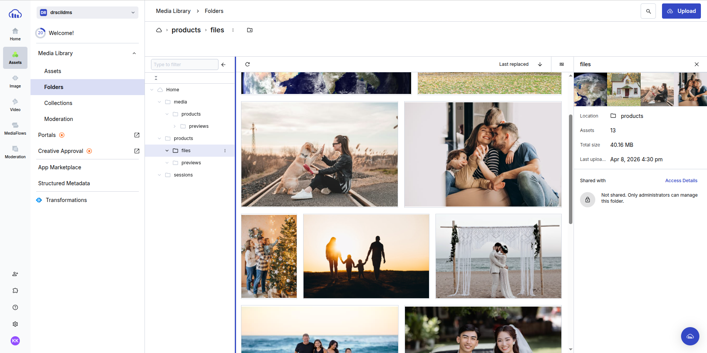|
| **Edit Session** | Modify date or price of a Photoshoot. | Changes saved and reflected on the public detail page. | Pass |  |
| **Defensive Deletion** | Delete a product already sold to a user. | System prevents hard delete; item is deactivated instead. | Pass |  |
---
#### Marketing & Communication
| Feature | Action | Expected Result | Actual Result | Visual Reference |
| :--- | :--- | :--- | :---: | :--- |
| **Newsletter Signup** | Enter email in footer form. | API call to Mailchimp successful; user added to audience. | Pass |  |
| **Social Integration** | Click Facebook link in Header. | Directs to the Facebook official page. Photographer's Hub Page was generated in Balsamiq.| Pass |  |
| **Responsive Check** | View Dashboard on a smartphone. | Layout adjusts using CSS Grid/Flex for mobile usability. | Pass |  |

---

### **Automated Testing**
The application employs automated testing via the Django `TestCase` framework to ensure high code reliability, security, and consistent business logic performance.
#### **Testing Strategy**
Following a robust testing approach, every User Story is supported by at least two automated test cases covering both "Happy Path" (success) and "Defensive" (failure/security) scenarios.

#### **Core Test Suites**
* **Role-Based Access (#6):** * `test_admin_access`: Confirms that users identified as photographers can access the management dashboard.
    * `test_client_denial`: Verifies that standard users are redirected when attempting to access administrative URLs.
* **Cart & E-commerce (#9, #10):**
    * `test_add_to_cart`: Ensures products are correctly stored in the session-based cart.
    * `test_license_limit`: Confirms digital photo licenses are limited to one per customer to prevent accidental duplicate purchases.
* **Service Management (#12, #15):**
    * `test_delete_session`: Validates that a photographer can permanently remove a photoshoot session from the database.
    * `test_public_visibility`: Ensures only active products and sessions are displayed to non-staff visitors.

#### **Execution Instructions**
To run the automated test suite, ensure your virtual environment is active and execute:
```bash
python3 manage.py test

```
[](docs/testing/auto_tests.png)

---

## Resolved Bugs & Known Issues

During the development and validation phases, several technical challenges and bugs were identified and resolved to ensure platform stability and adherence to coding standards.

### Key Resolved Issues

| # | File / Area | Issue Identified | Resolution |
| :--- | :--- | :--- | :--- |
| **1** | `photoshoot_detail.html` | **HTML Nesting Error:** Stray `</p>` tags caused by wrapping the Django `|linebreaks` filter inside manual `<p>` tags. | Replaced the outer `<p>` container with a `<div>`, allowing Django to handle semantic paragraph spacing. |
| **2** | `all_products.html` | **Unclosed Container:** The `page-container` div was missing its closing tag, causing layout shifts. | Identified the missing `</div>` during W3C validation and closed it before the final block. |
| **3** | `product_card.html` | **Heading Hierarchy:** Skipping heading levels ($H1 \rightarrow H3$) which impacted accessibility. | Changed the product title heading from `<h3>` to `<h2>` to maintain a logical document structure. |
| **4** | `products/forms.py` | **Missing Import:** `ValidationError` was used in the `clean_image` method but not imported from `django.core.exceptions`. | Added the missing import to ensure server-side file size validation works correctly. |
| **5** | `checkout/views.py` | **Namespace Conflict:** Redefinition of `User` and `Booking` models inside functions while they were already imported globally (`F811`). | Consolidated imports to the top of the file to improve memory efficiency and code clarity. |
| **6** | `cart/contexts.py` | **Unused Variables:** The `img_url` variable was assigned but never utilized in the final dictionary (`F841`). | Removed the redundant assignment to keep the context processor lean and PEP8 compliant. |
| **7** | `webhooks.py` | **Unused Exception Logic:** The exception variable `e` in try/except blocks was not being logged or used. | Refactored to `except Exception:` to satisfy linter requirements while maintaining error catching. |
| **8** | `products/views.py` | **Line Length violations:** Several success messages and logic blocks exceeded the project's 120-character limit. | Refactored long strings into multiline segments using parentheses for better readability. |
| **9** | `cart/contexts.py` | **File Termination (W292):** File ended without a newline character, which is required by POSIX standards. | Standardized file endings across all Python modules by adding a single trailing newline. |
| **10** | `marketing/apps.py` | **Signal Registration:** `marketing.signals` reported as "imported but unused" despite being critical for functionality. | Added the `# noqa` flag to the import within the `ready()` method to inform the linter of its intentional use. |

### Known Issues
* **Stripe Webhooks in Development:** Webhooks require the Stripe CLI or a tool like Ngrok to be tested locally. While fully functional on the live Heroku site, local testing depends on a stable tunnel connection.
* **Mailchimp API Latency:** Occasionally, there is a slight delay (1-2 seconds) when adding a new subscriber via the footer form as the server waits for the Mailchimp API response. This is mitigated by a loading state in the browser.

---
## Deployment

The live application is deployed on **Heroku** and can be accessed here:  
[Photographer Hub - Live Site](https://photographer-hub-94aeeeedb69e.herokuapp.com)

### Heroku Deployment

This project uses Heroku for cloud hosting. The following steps were taken for deployment:

1.  **App Creation:** A new app was created on the Heroku Dashboard with a unique name and the region set to Europe.
2.  **Config Vars:** To protect sensitive data and connect APIs, environment variables were configured in the **Settings > Reveal Config Vars** section. 

> [!IMPORTANT]
> To ensure the application functions correctly, the following keys must be set exactly as shown in the project configuration (values are private and should be replaced with your own keys if forking).


| Key | Purpose |
| :--- | :--- |
| `CLOUDINARY_URL` | Cloudinary API environment variable (includes Name, Key, Secret). |
| `DATABASE_URL` | PostgreSQL connection string from Code Institute. |
| `SECRET_KEY` | Django's unique secret key for security. |
| `STRIPE_PUBLIC_KEY` | Public key from the Stripe Dashboard. |
| `STRIPE_SECRET_KEY` | Private secret key from the Stripe Dashboard. |
| `STRIPE_WH_SECRET` | Signing secret for Stripe Webhooks (crucial for order processing). |
| `EMAIL_HOST_USER` | Gmail address for SMTP services. |
| `EMAIL_HOST_PASS` | 16-character App Password generated from Google Account. |
| `MAILCHIMP_API_KEY` | API Key from Mailchimp marketing dashboard. |
| `MAILCHIMP_EMAIL_LIST_ID` | Unique Audience ID for the newsletter. |
| `MAILCHIMP_DATA_CENTER` | The prefix of your API key (e.g., `us2`). |
| `DISABLE_COLLECTSTATIC` | Set to `1` during development (remove for final production). |

3.  **Deployment Files:** - `requirements.txt` contains all Python dependencies.
    - `Procfile` tells Heroku how to run the web process (`web: gunicorn photographer_hub.wsgi`).
    - `.python-version` specifies the environment (Python 3.12).
4.  **Static Files:** **WhiteNoise** is used to serve static files directly from Heroku, while **Cloudinary** handles all user-uploaded media (photoshoots and product previews).
5.  **GitHub Connection:** The Heroku app is connected to the GitHub repository with **Automatic Deploys** enabled for the `main` branch.

### Local Development

To run this project locally:
1. Clone the repository: `git clone https://github.com/Katerynakulik/photographer_hub.git`
2. Create an `env.py` file in the root directory and add the environment variables listed in the table above.
3. Install dependencies: `pip3 install -r requirements.txt`
4. Run migrations: `python3 manage.py migrate`
5. Start the server: `python3 manage.py runserver`

---

## Credits

### Content & Tools

This project was built as part of the Full Stack Software Development program.

| Source | Usage / Notes |
| :--- | :--- |
| [Balsamiq Cloud](https://balsamiq.cloud/) | Used for planning wireframes and prototyping the Facebook identity. |
| [Mailchimp](https://mailchimp.com/) | Integrated for automated email marketing and audience management. |
| [Image Online](https://crop-circle.imageonline.co/) | Used to crop profile and avatar images into professional circles. |
| [Font Awesome](https://fontawesome.com/) | Icons used for the UI (cart, user, calendar, etc.). |
| [Django Documentation](https://docs.djangoproject.com/) | Primary resource for logic and model relationships. |
| [Gemini](https://gemini.google.com/) | Assisted with code logic explanations and README structure optimization. |

### Media (Prototype Portfolio)

The images used in this project are high-quality placeholder assets intended to showcase the "Fine Art" aesthetic of a future professional site. All rights belong to the respective photographers.

| Image Theme | Photographer / Source | Link |
| :--- | :--- | :--- |
| **Main Brand Image** | **ShareGrid** (Unsplash) | [Hand holding camera](https://unsplash.com/photos/a-hand-holding-a-camera-ahNR0vCP_60) |
| **Hero/Background** | **Phil Hearing** (Unsplash) | [White house under trees](https://unsplash.com/photos/white-house-under-maple-trees-1ddol8rgUH8) |
| **Family Lifestyle** | **Freepik** | [Young family at home](https://www.freepik.com/free-photo/young-family-with-their-sons-home-having-fun_7435531.htm) |
| **Autumn Portraits** | **Freepik** | [Family in autumnal weather](https://www.freepik.com/free-photo/family-with-little-daughter-together-autumnal-weather-having-fun_19754602.htm) |
| **Sunset Silhouettes**| **Freepik** | [Happy family silhouette](https://www.freepik.com/free-photo/happy-family-silhouette-sunset_8380524.htm) |
| **Christmas Session** | **Freepik** | [Family by Christmas tree](https://www.freepik.com/free-photo/family-with-little-daughter-together-by-christmas-tree_21795010.htm) |
| **Wedding Couple** | **Pixabay** | [Marriage couple love](https://pixabay.com/photos/marriage-couple-wedding-love-4226896/) |
| **Beach Family** | **Pixabay** | [Family at the ocean](https://pixabay.com/photos/family-beach-people-ocean-6398107/) |
| **Man & Dog** | **Matthew Henry** (Unsplash)| [Man hugging tan dog](https://unsplash.com/photos/photo-of-man-hugging-tan-dog-ISg37AI2A-s) |
| **Kids Portrait** | **Jooinn** | [Kids Portrait - 14](https://jooinn.com/images/kids-14.jpg) |

### Acknowledgements

- I would like to thank the **Code Institute** tutors and Slack community for their continuous support.
- Special thanks to my mentor Tim Nelson for providing strategic feedback, help and support.